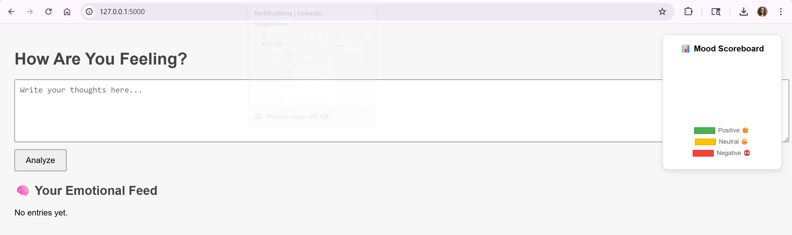
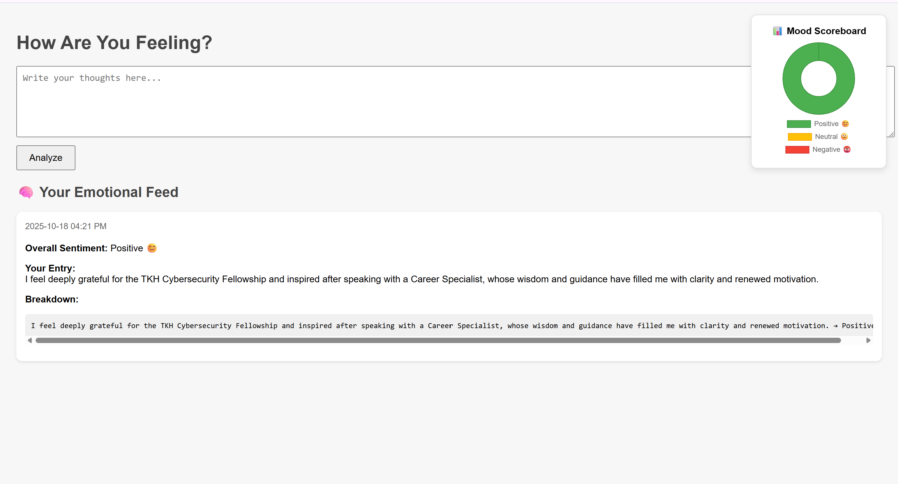
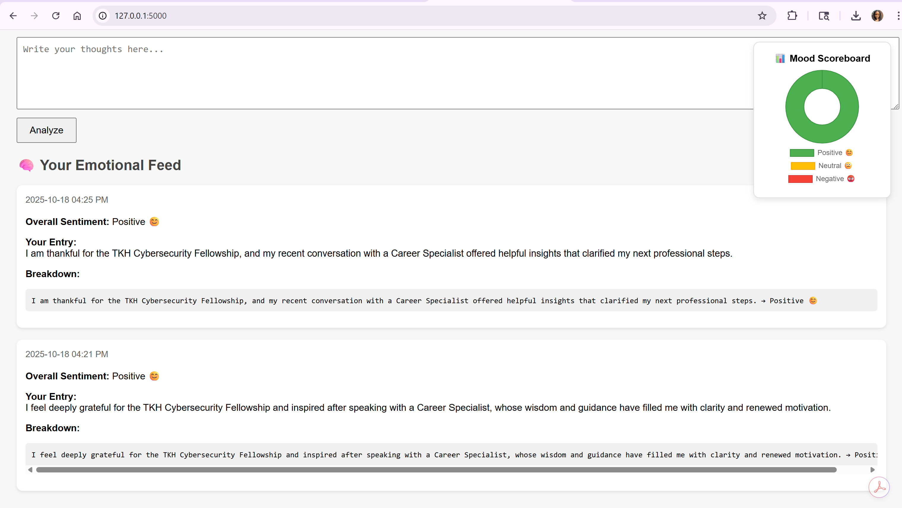
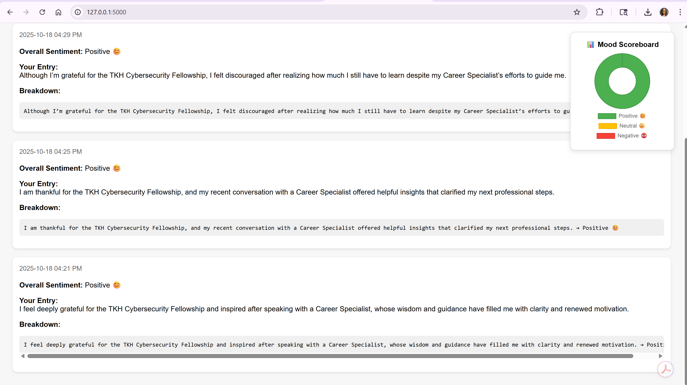

🧠 Sentiment Analysis Web Tool
### 🛠️ **Technologies Used (Implementation Summary)**

- **[TextBlob](https://textblob.readthedocs.io)** (Python NLP Library) — Configured and integrated a sentiment-analysis pipeline capable of evaluating text polarity and subjectivity for user-submitted entries.  

- **[Flask](https://flask.palletsprojects.com)** Framework — Built a lightweight, modular web application supporting real-time text input, prediction processing, and dynamic template rendering.  

- **[Flask-SQLAlchemy](https://flask-sqlalchemy.palletsprojects.com)** ORM — Implemented relational data modeling for persistent storage of sentiment entries using an SQLite backend.  

- **[SQLite](https://www.sqlite.org)** Database — Designed a compact, file-based database for efficient local data management during development and testing.  

- **[HTML5](https://developer.mozilla.org/en-US/docs/Web/Guide/HTML/HTML5)** / [CSS3](https://developer.mozilla.org/en-US/docs/Web/CSS) Front-End — Developed responsive user interfaces for data input and results display with clean, minimal styling. 

- **[Render](https://render.com)** Cloud Hosting — Deployed the Flask application via Render for continuous integration and delivery (CI/CD) directly from GitHub.

🚀 How to Run Locally
1. Clone the repository
git clone https://github.com/ldodson10/sentiment-app.git
cd sentiment-app
2. Create and activate a virtual environment (recommended):
python -m venv venv
venv\Scripts\activate        # On Windows
3. Install the required packages:
pip install -r requirements.txt
4. Run the application:
python app.py
Visit http://localhost:5000 in your browser.

☁️ Deployment with Render
This project is deployed using Render, a cloud hosting platform that enables developers to launch web applications with ease.

⚡ Why Render?
Render simplifies the process of hosting and running backend applications like this Flask-based sentiment analysis tool. It automatically pulls the latest code from GitHub and deploys it, eliminating the need to manually manage infrastructure.

🔧 Workflow Overview
GitHub is used to store, version, and manage the project code.
Render connects to the GitHub repository, builds the application, and hosts it live.

## 🧪 Deployment Verification

The local Flask environment was successfully rebuilt and verified on Windows PowerShell 5.1.
The application launched successfully on `http://127.0.0.1:5000`, confirming that dependencies, routes, and templates were restored correctly.

**Verification Screenshot:**

🔗 Live Demo: https://sentiment-app-6y17.onrender.com

🗂️ Project Structure

📁 sentiment-app/
├── app.py                # Main application logic  
├── requirements.txt      # Python dependencies  
├── render.yaml           # Render deployment configuration  
├── templates/  
│   ├── index.html        # Input form page  
│   └── result.html       # Output results page  
├── static/               # Static assets (if any)  
├── docs/  
│   └── *.png             # Sentiment screenshots and verification evidence  
└── README.md             # Project documentation

## 🧠 Sentiment Analysis Testing & Results

After resolving the `textblob.exceptions.MissingCorpusError` and restoring Flask server connectivity, the **Sentiment App** was tested using three statements representing different emotional tones. Each statement referenced gratitude for the **TKH Cybersecurity Fellowship** and an interaction with a **Career Specialist**.

---

### 🧩 Test Inputs

1. **Positive**
   > "I feel deeply grateful for the TKH Cybersecurity Fellowship and inspired after speaking with a Career Specialist, whose wisdom and guidance have filled me with clarity and renewed motivation."

2. **Neutral**
   > "I am thankful for the TKH Cybersecurity Fellowship, and my recent conversation with a Career Specialist offered helpful insights that clarified my next professional steps."

3. **Negative (Expected)**
   > "Although I'm grateful for the TKH Cybersecurity Fellowship, I felt discouraged after realizing how much I still have to learn despite my Career Specialist's efforts to guide me."

---

### 📊 Results Summary

| Test Case | Expected Sentiment | App Result | Notes |
|------------|-------------------|-------------|--------|
| Positive | Positive 😊 | ✅ Positive | Matches expectation |
| Neutral | Neutral 😐 | ➡️ Positive | Lexical bias toward gratitude phrasing |
| Negative | Negative 😞 | ➡️ Positive | Model interprets learning/growth terms as positive contextually |

---

### 📸 Evidence Screenshots

| Description | File Name |
|--------------|------------|
| Positive Result #1 | `LocalApp_Run_Success_SentimentApp_Positive_1.png` |
| Positive Result #2 | `LocalApp_Run_Success_SentimentApp_Positive_2.png` |
| Positive Result #3 (Expected Negative) | `LocalApp_Run_Success_SentimentApp_Positive_3.png` |

---

### 🧭 Observations

TextBlob's sentiment analyzer displays a consistent **bias toward positive classification** when sentences contain gratitude-oriented or reflective language.  
This demonstrates a common limitation of **rule-based sentiment models**: they evaluate polarity primarily through individual words rather than contextual nuance.

**Future Improvement:** integrate a **Transformer-based NLP model** such as `DistilBERT`, `RoBERTa`, or `VADER` to provide deeper contextual comprehension and more accurate classification of mixed or ambiguous emotional expressions.

_Updated and verified: October 18, 2025 — Functional Sentiment App deployment confirmed on Render and localhost._

---
